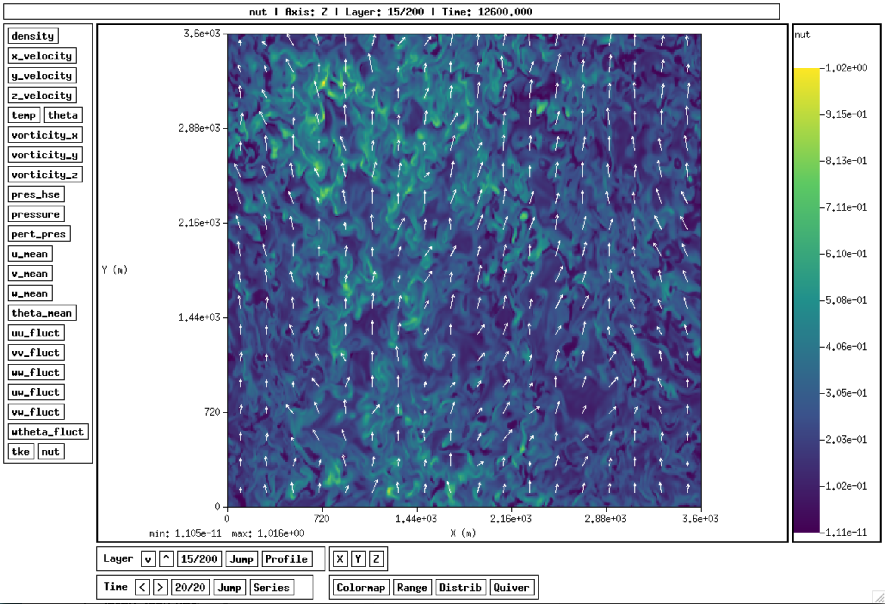
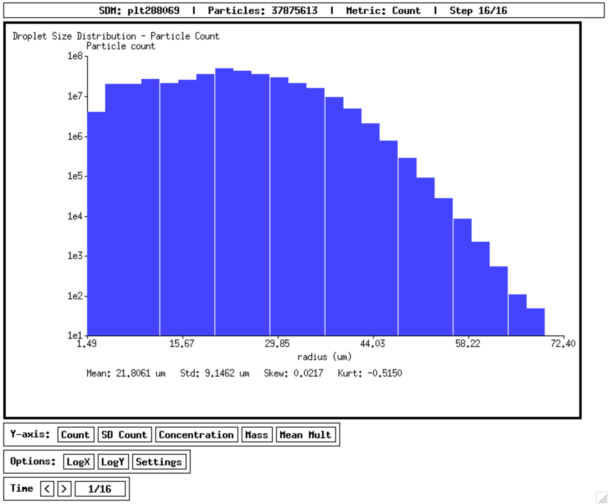

# pltview: A simple viewer for AMReX plotfiles (test version)

A lightweight X11 viewer for AMReX plotfiles, inspired by ncview and built with the assistance of Claude Code and Copilot. This is mainly designed for Energy Research and Forecasting (ERF), but it may also be used for plt file output from other models.



## Features

- **Direct X11 rendering** with minimal dependencies
- **Multi-level AMR support**: Automatically detects and visualizes multiple refinement levels
- **Multi-timestep support**: Navigate through time series data with `<`/`>` buttons or Left/Right arrow keys
- **Interactive 3D slicing**: View 2D slices of 3D data along X, Y, Z axes with wrap-around navigation
- **Mouse interaction**:
  - Hover to see values at cursor position
  - Click to view 1D line profiles along X, Y, Z directions in popup window
- **Statistical analysis**:
  - Profile: View mean, std, and skewness along the slicing axis
  - Distribution: View histogram of values in current layer
  - Series: View time series of mean, std, and skewness across all timesteps (multi-timestep mode)
- **Custom colorbar range**: Set min/max values manually or use auto-scaling
- **Multiple colormap options**: viridis, jet, turbo, plasma, hot, cool, gray, magma (selectable via popup or keys 1-8)
- **Level handling**: Preserves slice position when switching between AMR levels
- **Dynamic grid adaptation**: Automatically adjusts to different grid dimensions per level
- **Variables supported**: Displays all available variables (up to 128) in the sidebar

## Installation

### Via pip (Recommended)

```bash
pip install git+https://github.com/wang1202/pltview.git
```
or
```bash
pip install git+ssh://git@github.com/wang1202/pltview.git
```

### Editable Install (For Development)

If you want to modify the code and have changes take effect immediately:

```bash
git clone https://github.com/wang1202/pltview.git
cd pltview
pip install -e .
```

After editable install, you can modify `pltview.c` and rebuild:

```bash
make
# Changes take effect immediately - pltview command uses the updated binary
```

### Upgrading

If you already have pltview installed and want to upgrade to the latest version:

```bash
pip install --upgrade git+https://github.com/wang1202/pltview.git
```

For editable installs, pull the latest changes and rebuild:

```bash
cd pltview
git pull
make
```

### From Source (Manual Build)

```bash
git clone https://github.com/wang1202/pltview.git
cd pltview
make
./pltview plt00100
```

**Prerequisites:**

- **macOS**: Install XQuartz from https://www.xquartz.org/
- **Linux**: Install X11 development libraries:
  - Debian/Ubuntu: `sudo apt-get install libx11-dev libxt-dev libxaw7-dev libxmu-dev`
  - RHEL/CentOS: `sudo yum install libX11-devel libXt-devel libXaw-devel libXmu-devel`

## Usage

After installation:

```bash
# Single plotfile
pltview plt00100

# Multi-timestep mode (directory containing multiple plotfiles)
pltview /path/to/simulation/output plt

# With different prefix (e.g., plt2d for 2D output)
pltview /path/to/simulation/output plt2d
```

**Multi-timestep mode** automatically scans the directory for plotfiles matching the specified prefix (default: `plt`), sorts them by numerical suffix, and allows navigation between timesteps using `<`/`>` buttons or Left/Right arrow keys.

### SDM Mode (Super Droplet Method)



```bash
# Single plotfile
pltview --sdm plt00100

# Multi-timestep mode (auto-detects prefix)
pltview --sdm /path/to/simulation/output

# With explicit prefix
pltview --sdm /path/to/simulation/output plt
```

SDM mode displays droplet size distribution histograms from AMReX particle data (`super_droplets_moisture` subdirectory). Features include selectable Y-axis metrics (particle count, SD count, concentration, mass, mean multiplicity), log X/Y scale toggles, configurable cutoff radius and bin width, and statistics (mean, std, skewness, kurtosis) in micrometers.

**Note:** Reading multiple timesteps in SDM mode may cause noticeable lag due to the large volume of particle data being read from disk at each timestep switch.

## Controls

**GUI Layout:**

- **Left sidebar**: Variable selection buttons (all available variables, up to 128 supported)
- **Main canvas**: Data visualization with white background and aspect ratio preservation
- **Right colorbar**: Data range and colormap scale
- **Bottom controls** (organized in rows and columns):
  - **Row 1, Column 1**: Axis (X/Y/Z), Layer navigation (v/^), Jump, Profile
  - **Row 1, Column 2**: Colormap, Range, Distrib
  - **Row 1, Column 3**: Level selection (Level 0/Level 1/...) - appears when multiple AMR levels detected
  - **Row 2**: Time navigation (`<`/`>`, Jump, Series) - appears only in multi-timestep mode

**Mouse Interaction:**

- **Hover**: Shows value at cursor position in info label at top
- **Click**: Opens popup window with line profiles along X, Y, Z directions

**Buttons:**

- **Variable Buttons**: Select which variable to visualize
- **X/Y/Z Buttons**: Switch viewing axis (perpendicular to slice)
- **v/^ Buttons**: Navigate through layers with wrap-around
- **Jump**: Quick jump to specific layer positions (First, 1/4, Middle, 3/4, Last) or type a layer number
- **Profile**: Show mean, std, and skewness statistics along the current axis
- **Colormap**: Open popup to select from 8 colormaps (1-8: viridis/jet/turbo/plasma/hot/cool/gray/magma)
- **Range**: Set custom colorbar min/max values, or reset to auto
- **Distrib**: Show histogram distribution of values in the current layer
- **Time `<`/`>`**: Navigate through timesteps (multi-timestep mode only)
- **Time Jump**: Quick jump to specific timestep (First, 1/4, Middle, 3/4, Last, or type a number)
- **Series**: Show time series of mean, std, and skewness for current slice across all timesteps
- **Level Buttons**: Switch between AMR refinement levels (appears when multiple levels detected)

**Keyboard Shortcuts:**

| Key | Action |
|-----|--------|
| `Up` / `+` / `=` | Next layer |
| `Down` / `-` / `_` | Previous layer |
| `Right` | Next timestep (multi-timestep mode) |
| `Left` | Previous timestep (multi-timestep mode) |
| `1` - `8` | Select colormap (1=viridis, 2=jet, 3=turbo, 4=plasma, 5=hot, 6=cool, 7=gray, 8=magma) |

**Line Profile Popup:**
The popup window displays three graphs showing how the variable value changes along each spatial dimension (X, Y, Z) through the clicked point, with proper axis labels and tick marks.

## Requirements

- **C Compiler**: gcc or clang
- **X11 Libraries**:
  - macOS: XQuartz (https://www.xquartz.org/)
  - Linux: libX11, libXt, libXaw, libXmu development packages
- **Python**: >= 3.6 (for pip installation wrapper)

## File Format

This tool reads AMReX plotfile format (used by ERF, AMReX-Hydro, etc.):

- `Header`: Metadata about variables and grid structure
- `Level_0/`, `Level_1/`, ...: Data directories for each AMR refinement level
- `Cell_D_XXXXX`: FAB binary data files for each MPI domain
- `Cell_H`: Cell data header with box layout and FabOnDisk mapping

**Multi-level Support:**

- Automatically detects available AMR levels by scanning for `Level_X` directories
- Handles varying grid dimensions across different refinement levels
- Preserves slice position when switching levels (clamped to valid range if needed)

Each Cell_D file contains a FAB (Fortran Array Box) header followed by binary double-precision floating-point data in Fortran (column-major) order.

## License

MIT License - see [LICENSE](LICENSE) for details.

Additional government disclaimer - see [DISCLAIMER.md](DISCLAIMER.md).

## Citation

If you use this package in your research, please consider citing or acknowledging:

```bibtex
@software{pltview,
  author = {Wang, Aaron},
  title = {pltview: A simple viewer for AMReX plotfiles},
  year = {2025},
  url = {https://github.com/wang1202/pltview}
}
```
